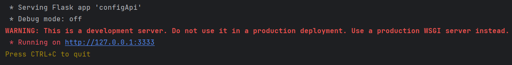
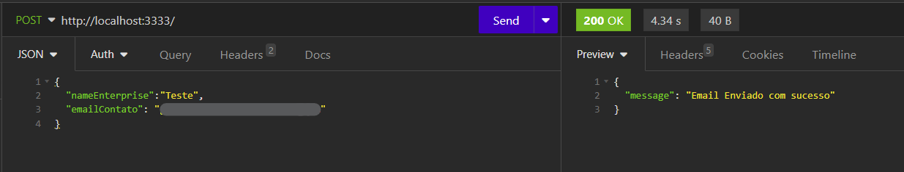
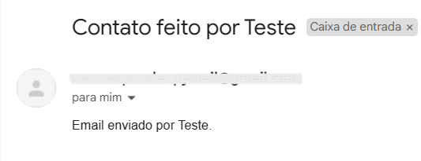

<h1> EmailApi</h1>

The project was developed as a personal challenge to train my skills in API building and email sending.

<h3>Before running the script, follow these steps:</h3>
<ul>
    <li>Create a new email to use in the project if you don't already have one.</li>
    <li>Enable two-step verification to make your account more secure. You can do this by visiting https://myaccount.google.com/security and following the instructions to set up two-step verification.</li>
    <li>After setting up two-step verification, search for "App passwords" in your Google account's search bar.</li>
    <li>Click on the "App passwords" option to create an app-specific password.</li>
    <li>Follow the instructions to generate an app password. You can select the "Other (custom name)" option and give your app a name, which will make it easier to identify.</li>
    <li>Make a note of the generated application password, as you will need it to authenticate your script.</li>
</ul>

<h2>Running</h2>
<ul>
    <li>Run `pip install -r requirements.txt` to install the packages</li>
    <li>Run `py main.py`</li>
</ul>

Após seguir estas etapas, o script iniciará o servidor:

To send the email you will need an api testing application. I recommend using <a href="https://insomnia.rest/">insomnia</a>.

Once insomnia is installed, just send a json requisition like this:

And finally an email will arrive to the recipient:

